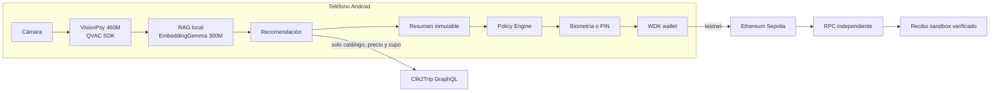

# Clik2Trip Sovereign

> Inteligencia turística privada en el teléfono: fotografía un lugar, recibe
> recomendaciones locales y autoriza pagos de prueba en USD₮ sin entregar a un
> modelo en la nube tu imagen, tus preferencias ni tu capacidad de firma.

[](https://github.com/JVeraPTY/clik2trip-sovereign/actions/workflows/ci.yml)
[](https://github.com/JVeraPTY/clik2trip-sovereign/actions/workflows/android-preview.yml)
[](LICENSE)

## Entrega del hackathon

| Recurso | Enlace |
| --- | --- |
| Video final, 2:30 | **[Ver demostración](https://github.com/JVeraPTY/clik2trip-sovereign/releases/download/v0.2.0-hackathon/clik2trip-sovereign-demo.mp4)** |
| Aplicación Android | **[Descargar APK firmado](https://github.com/JVeraPTY/clik2trip-sovereign/releases/download/v0.2.0-hackathon/clik2trip-sovereign.apk)** |
| Entrega completa | [GitHub Release `v0.2.0-hackathon`](https://github.com/JVeraPTY/clik2trip-sovereign/releases/tag/v0.2.0-hackathon) |
| Guía de evaluación | [Instalación y prueba para jueces](JUDGES.md) |
| Evidencia técnica | [Resultados de la Fase 5](docs/phase-5-evaluation.md) |

La release corresponde al commit `c6510ec`, Android `versionCode` 2 y paquete
`com.clik2trip.sovereign`. El APK, su checksum, el video, el manifiesto y los
informes de calidad y rendimiento se descargan sin una cuenta de GitHub.

## La propuesta

En turismo, una conexión inestable puede interrumpir la búsqueda justo cuando
el viajero más la necesita. Enviar fotografías a un servicio remoto también
crea un problema de privacidad, y delegar en un modelo probabilístico una
reserva o un pago sería un riesgo innecesario.

Clik2Trip Sovereign separa esas responsabilidades:

1. **VisionPsy interpreta la fotografía en el dispositivo.** La imagen vive
   temporalmente en el almacenamiento privado de la aplicación y se elimina al
   terminar el análisis.
2. **QVAC RAG consulta un catálogo local.** La recomendación puede terminar en
   modo avión después de descargar los modelos una sola vez.
3. **El comercio se revalida de forma determinista.** Para un tour real, la app
   consulta por HTTPS la identidad del catálogo, el precio, el cupo y un horario
   exacto antes de crear un hold de 15 minutos.
4. **La IA nunca autoriza el pago.** El viajero revisa un resumen inmutable y lo
   aprueba con la credencial del dispositivo.
5. **WDK ejecuta una transferencia de prueba.** El build del hackathon está
   limitado a USD₮ de prueba en Ethereum Sepolia.
6. **Una fuente independiente verifica el resultado.** La aplicación resuelve
   la UserOperation y vuelve a leer el recibo, los logs ERC-20 y las
   confirmaciones desde un RPC diferente del bundler.

El resultado es un flujo completo —descubrimiento, recomendación, reserva,
autorización y recibo— donde la IA aporta contexto sin convertirse en autoridad.

## Cumplimiento de los retos

| Requisito | Evidencia en este proyecto |
| --- | --- |
| Inferencia con QVAC | Toda la inferencia evaluada y el RAG usan `@qvac/sdk` 0.19.0 |
| Modelo Psy central | VisionPsy Nano 460M analiza la imagen que inicia el flujo principal |
| Ejecución *edge* | Inferencia y recuperación local probadas en un teléfono Android arm64 físico |
| Sin inferencia remota | No existe endpoint ni fallback de IA en la nube |
| Experiencia útil sin red | Con los modelos en caché, análisis y recomendación funcionan en modo avión |
| Flujo de usuario completo | Foto → recomendación → hold → autorización → USD₮ de prueba → recibo |
| Evidencia reproducible | Dataset congelado, registros estructurados, métricas, checksums y APK firmado |
| Código abierto | Licencia permisiva MIT |

Pears no forma parte de esta versión. La comunicación entre pares es un criterio
adicional del reto general, no un requisito para la experiencia local presentada.

## Arquitectura



La frontera es intencional: ninguna imagen, salida del modelo, perfil local,
semilla o capacidad de firma se envía al Gateway. La red se usa únicamente para
funciones no relacionadas con la inferencia: revalidación comercial y liquidación
de prueba.

### Componentes del monorepo

| Ruta | Responsabilidad |
| --- | --- |
| `apps/android` | Aplicación Expo 55 / React Native 0.83 para Android |
| `packages/qvac-edge` | Sesión VisionPsy, extracción estructurada y RAG local |
| `packages/contracts` | Contratos y validación de datos compartidos |
| `packages/cliktotrip-client` | Frontera GraphQL tipada con la plataforma existente |
| `packages/policy-engine` | Decisiones deterministas y códigos estables de rechazo |
| `packages/wdk-wallet` | Wallet WDK, resumen firmado y transferencia en Sepolia |
| `packages/performance-log` | Registros de modelo, tokens, TTFT y throughput |
| `services/usdt-verifier` | Verificación independiente del recibo sandbox |
| `evaluation` | Casos congelados, resultados físicos e informes agregados |

## Modelos y hardware evaluado

| Campo | Valor |
| --- | --- |
| Dispositivo | Xiaomi 23117RA68G |
| Sistema | Android 16, API 36, arm64-v8a |
| SDK | QVAC SDK 0.19.0 |
| Visión | VisionPsy Nano 460M Flash `Q4_K_M` |
| Proyección multimodal | VisionPsy Nano 460M Flash `Q8_0` |
| Embeddings | EmbeddingGemma 300M `Q4_0` |
| Backend medido | GPU |
| Activos de modelo | Aproximadamente 412 MB en la primera descarga |

QVAC no admite el emulador como evidencia de aceptación de este proyecto. Las
mediciones publicadas provienen de hardware físico declarado.

## Resultados reproducibles

La evaluación congeló 20 imágenes con página fuente, autor, licencia, tamaño y
SHA-256 antes de ejecutar el modelo. Las 20 filas son válidas; 18 inferencias
terminaron y dos fallaron. Los fallos permanecen en el denominador y puntúan
cero: no se filtraron para mejorar los resultados.

| Métrica | Resultado |
| --- | ---: |
| Exactitud de categoría | 25 % |
| Exactitud de recomendación Top-3 | 30 % |
| Exactitud de duración | 70 % |
| Recall de restricciones | 90 % |
| Explicaciones fundamentadas | 35 % |
| Brier score de confianza | 0.278 |
| TTFT mediano en caliente | 43.7 s |
| TTFT p95 en caliente | 92.3 s |
| Throughput mediano | 6.62 tokens/s |
| Throughput p95 | 6.94 tokens/s |

Estas cifras muestran tanto la viabilidad como el límite del modelo nano. Su
calidad no es suficiente para decidir una reserva o un pago; por eso el
filtrado, la revalidación, la política y la autorización humana son barreras
deterministas separadas. El detalle completo está en
[`docs/phase-5-evaluation.md`](docs/phase-5-evaluation.md).

## Instalar el APK

Requisitos del teléfono:

- Android 12 o posterior (`minSdkVersion` 31).
- Arquitectura arm64.
- Aproximadamente 1.5 GB libres para la app y los modelos.
- Wi-Fi y cargador durante el primer inicio.
- Bloqueo de pantalla activo si se probará la autorización del pago.

Descarga `clik2trip-sovereign.apk` y
`clik2trip-sovereign.apk.sha256` desde la
[release pública](https://github.com/JVeraPTY/clik2trip-sovereign/releases/tag/v0.2.0-hackathon).
Verifica el archivo antes de instalarlo:

```bash
shasum -a 256 -c clik2trip-sovereign.apk.sha256
adb install -r clik2trip-sovereign.apk
```

Si Android responde `INSTALL_FAILED_UPDATE_INCOMPATIBLE`, hay una versión de
previsualización firmada con otro certificado. Desinstalarla elimina también la
wallet local, por lo que debes guardar antes cualquier evidencia que necesites:

```bash
adb uninstall com.clik2trip.sovereign
adb install clik2trip-sovereign.apk
```

La [guía para jueces](JUDGES.md) explica el primer inicio, la prueba sin red y el
flujo opcional de USD₮ paso a paso.

## Desarrollo local

### Requisitos

- Node.js 24 y pnpm 11.19.0.
- Java 17.
- Android SDK 36, Build Tools 36.0.0 y NDK 29.0.14206865.
- Teléfono Android arm64 con depuración USB habilitada.

### Preparación y ejecución

```bash
pnpm install
cp apps/android/.env.example apps/android/.env
pnpm wdk:bundle
pnpm check
pnpm android:prebuild
pnpm android:device
```

El primer inicio descarga y carga los modelos fijados. Mantén el teléfono
conectado a una red estable y a la corriente durante ese paso. Una vez en caché,
la inferencia se ejecuta localmente.

`pnpm android:prebuild` regenera el proyecto nativo, configura los complementos
de QVAC y WDK, habilita ubicación aproximada y bloquea ubicación precisa.

### Verificaciones

```bash
pnpm check
pnpm evaluation:quality:strict
pnpm evaluation:report:strict
```

`pnpm check` ejecuta lint, typecheck y 150 pruebas. Los comandos estrictos exigen
los 20 casos de calidad y al menos una medición fría más cinco mediciones
calientes correctas.

## Configuración y servicios remotos declarados

Los valores públicos de desarrollo están documentados en
[`apps/android/.env.example`](apps/android/.env.example):

- `https://www.clik2trip.com/graphql`: catálogo, disponibilidad y hold; nunca IA.
- RPC público de Ethereum Sepolia: verificación independiente.
- Bundler y paymaster públicos de Candide: UserOperation ERC-4337 de prueba.
- Contrato USD₮ de prueba: `0xd077a400968890eacc75cdc901f0356c943e4fdb`.

`EXPO_PUBLIC_SANDBOX_TARIFF_USDT` controla el nominal de prueba transferido. El
valor predeterminado es `0.01`; `full` usa el total congelado de la reserva. La
pantalla siempre diferencia el precio de la experiencia del importe testnet.

Nunca guardes secretos en variables `EXPO_PUBLIC_*`: Expo las incorpora al APK.
Las credenciales de firma Android viven únicamente en GitHub Actions Secrets.

## Privacidad y seguridad

- La foto se conserva solo durante el análisis y su eliminación se comprueba
  mediante una nueva lectura del almacenamiento.
- Los registros no incluyen imágenes, prompts completos, semillas, claves
  privadas ni direcciones completas.
- El modelo no puede acceder a la seed, la clave privada, la operación de firma
  ni el método de transferencia.
- El Policy Engine fija red, token, destinatario, importes, hash, expiraciones y
  límite de demostración antes de invocar WDK.
- El build solo permite Ethereum Sepolia; no existe ruta a mainnet.
- El estado del pago sandbox y el estado de la reserva permanecen separados.

Consulta [`docs/security.md`](docs/security.md) para el modelo de amenazas y los
límites de confianza.

## Catálogo de demostración

El snapshot local contiene cuatro tours del catálogo preexistente de Clik2Trip y
52 experiencias de demostración escritas para este repositorio, distribuidas en
nueve regiones de Panamá. No se rastreó ninguna plataforma, no se copiaron
textos, imágenes ni precios de terceros y no se nombran operadores reales.

Las experiencias sintéticas muestran una etiqueta `DEMO` y nunca crean una
reserva en el Gateway. La procedencia completa está en
[`docs/demo-catalog.md`](docs/demo-catalog.md).

## Trabajo preexistente

La marca, el sitio web, el catálogo, el Gateway GraphQL, los servicios Search,
Booking, Payments y Notification, y la infraestructura original de Clik2Trip
existían antes del hackathon. Son dependencias externas de esta propuesta y no
se presentan como trabajo nuevo.

El trabajo del hackathon comienza con el
[primer commit de este repositorio](https://github.com/JVeraPTY/clik2trip-sovereign/commit/e5679bfe37bf2240e889d81d49dbefb4c46aa9fd):
la aplicación Android, la integración QVAC/VisionPsy, el RAG local, el cliente
móvil, el Policy Engine, WDK, la experiencia testnet, la verificación, las
métricas, el dataset y los materiales de entrega. La frontera detallada y
archivo por archivo está declarada en
[`docs/preexisting-work.md`](docs/preexisting-work.md).

## Documentación

- [ADR de compatibilidad y baseline](docs/ADR-001-compatibility-baseline.md)
- [Evidencia del dispositivo físico](docs/compatibility-gate.md)
- [Evaluación de la Fase 2](docs/phase-2-evaluation.md)
- [Evaluación de la Fase 3](docs/phase-3-evaluation.md)
- [Evaluación de la Fase 4](docs/phase-4-evaluation.md)
- [Evaluación y entrega de la Fase 5](docs/phase-5-evaluation.md)
- [Guion y evidencia del video](docs/demo-video.md)
- [Seguridad](docs/security.md)

## Limitaciones

- Es software de hackathon, no una wallet de producción ni una agencia de viajes.
- Solo usa activos sin valor en Ethereum Sepolia.
- VisionPsy genera sugerencias; no diagnostica, reserva ni paga de forma autónoma.
- El catálogo local necesita una actualización versionada para reflejar cambios.
- La revalidación de tours reales y la liquidación testnet requieren conexión.
- Los RPC públicos y el faucet pueden imponer límites ajenos a la aplicación.

## Licencia

Este repositorio se distribuye bajo la [licencia MIT](LICENSE).
